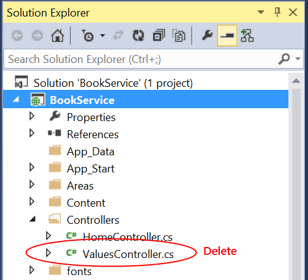
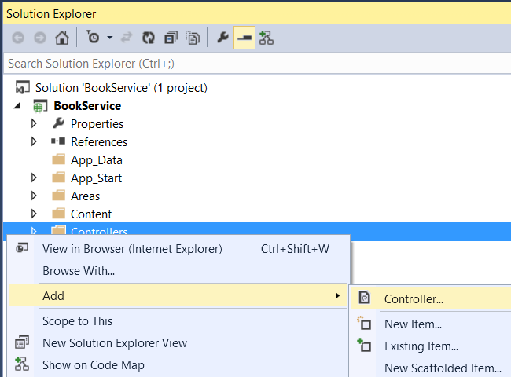
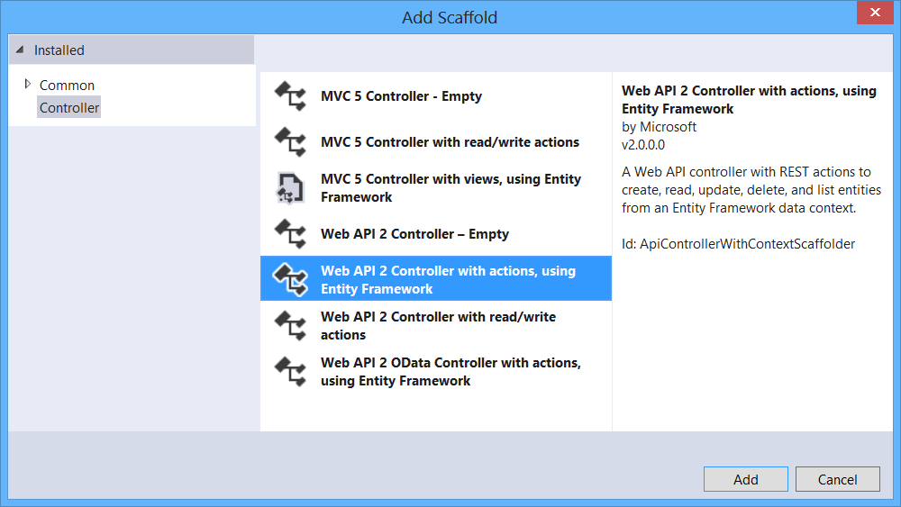
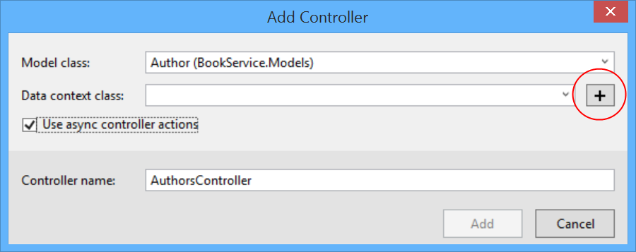
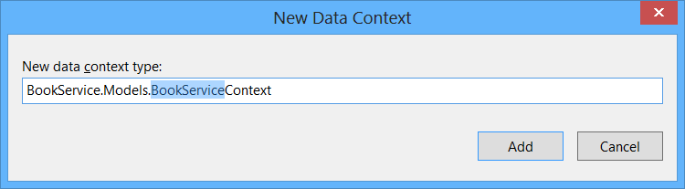
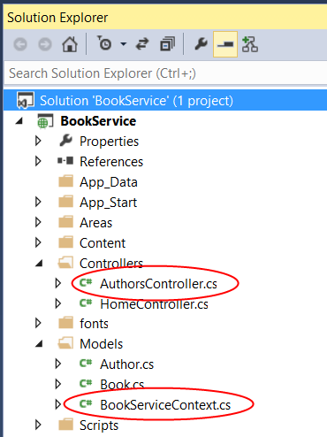
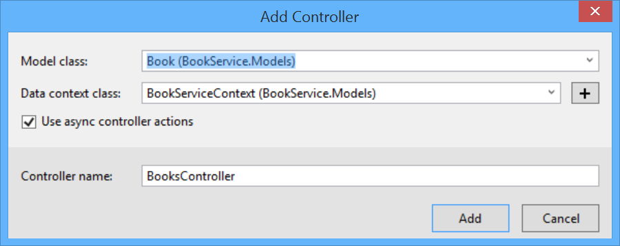

# pcf-book-service
A simple web application with an ASP.NET Web API back end. Uses Entity Framework 6 for the data layer.

References:

1) [ASP.Net Web-API Example] (http://www.asp.net/web-api/overview/data/using-web-api-with-entity-framework/part-1) (steps 1-4)

2) [ASP.Net API Help Pages Example] (http://www.asp.net/web-api/overview/getting-started-with-aspnet-web-api/creating-api-help-pages)

3) [cURL] (http://curl.haxx.se/download.html)

```
Note:
When creating the API Help pages in this project, file ~/App_Data/XmlDocument.xml 
must be included in the project or it will not be published for deployment.
```
```
Examples:
1) Create a new book with an existing author:
curl -i -X POST -H "Content-Type: application/json" http://pcf-book-service.west-1.fe.gopivotal.com/api/books -d '{"Title":"Book Title","Year":2105,"Price":19.95,"Genre":"Fantasy","AuthorId":1}'
2) Create a new book and a new author:
curl -i -X POST -H "Content-Type: application/json" http://pcf-book-service.west-1.fe.gopivotal.com/api/books -d '{"Title":"Book Title","Year":2105,"Price":19.95,"Genre":"Fantasy","Author": {"Name":"Public, John Q."}}'
```

# Build The Sample Project

{Adapted from [Using Web API 2 with Entity Framework 6 by Mike Wasson](http://www.asp.net/web-api/overview/data/using-web-api-with-entity-framework/part-1 "ASP.NET Forum")}

#### 1) Create the Project
Open Visual Studio. From the File menu, select New, then select Project. (Or click New Project on the Start page.)

In the New Project dialog, click Web in the left pane and ASP.NET Web Application in the middle pane. Name the project BookService and click OK.


In the New ASP.NET Project dialog, select the Web API template.


#### 2) Add Models and Controllers

##### Add Model Classes

In this tutorial, we'll create the database by using the "Code First" approach to Entity Framework (EF). With Code First, you write C# classes that correspond to datbase tables, and EF creates the database. (For more information, see Entity Framework Development Approaches.)

We start by defining our domain objects as POCOs (plain-old CLR objects). We will create the following POCOs:

  * Author
  * Book

In Solution Explorer, right click the Models folder. Select Add, then select Class. Name the class Author.


Replace all of the boilerplate code in Author.cs with the following code:

```
using System.Collections.Generic;
using System.ComponentModel.DataAnnotations;

namespace BookService.Models
{
    public class Author
    {
        public int Id { get; set; }
        [Required]
        public string Name { get; set; }
    }
}
```

Add another class named Book, with the following code:

```
using System.ComponentModel.DataAnnotations;

namespace BookService.Models
{
    public class Book
    {
        public int Id { get; set; }
        [Required]
        public string Title { get; set; }
        public int Year { get; set; }
        public decimal Price { get; set; }
        public string Genre { get; set; }

        // Foreign Key
        public int AuthorId { get; set; }
        // Navigation property
        public Author Author { get; set; }
    }
}
```

Entity Framework will use these models to create database tables. For each model, the Id property will become the primary key column of the database table.

In the Book class, the AuthorId defines a foreign key into the Author table. (For simplicity, I’m assuming that each book has a single author.) The book class also contains a navigation property to the related Author. You can use the navigation property to access the related Author in code. I say more about navigation properties in part 4, Handling Entity Relations.

##### Add Web API Controllers

In this section, we’ll add Web API controllers that support CRUD operations (create, read, update, and delete). The controllers will use Entity Framework to communicate with the database layer.

First, you can delete the file Controllers/ValuesController.cs. This file contains an example Web API controller, but you don’t need it for this tutorial.



Next, build the project. The Web API scaffolding uses reflection to find the model classes, so it needs the compiled assembly.

In Solution Explorer, right-click the Controllers folder. Select Add, then select Controller.



In the Add Scaffold dialog, select “Web API 2 Controller with actions, using Entity Framework”. Click Add.



In the Add Controller dialog, do the following:

  1. In the Model class dropdown, select the Author class. (If you don't see it listed in the dropdown, make sure that you built the project.)
  2. Check “Use async controller actions”.
  3. Leave the controller name as "AuthorsController".
  4. Click plus (+) button next to Data Context Class.



In the New Data Context dialog, leave the default name and click Add.



Click Add to complete the Add Controller dialog. The dialog adds two classes to your project:

  * AuthorsController defines a Web API controller. The controller implements the REST API that clients use to perform CRUD operations on the list of authors.
  * BookServiceContext manages entity objects during run time, which includes populating objects with data from a database, change tracking, and persisting data to the database. It inherits from DbContext.



At this point, build the project again. Now go through the same steps to add an API controller for Book entities. This time, select Book for the model class, and select the existing BookServiceContext class for the data context class. (Don't create a new data context.) Click Add to add the controller.



Add a class named CloudSQLConnection, with the following code:

```
using System;
using System.Collections.Generic;
using System.Linq;
using System.Web;

namespace BookService
{
    public class CloudSQLConnection
    {
        private static String actualConnection = String.Empty;

        public static String ConnectionString
        {
            get
            {
                if (actualConnection == String.Empty)
                {
                    Console.WriteLine(String.Format("CloudSQLConnection.ConnectionString"));
                    loadConnectionString();
                }
                return actualConnection;
            }
        }

        private static void loadConnectionString()
        {
            try
            {
                String vcapServicesEnvVariable = Environment.GetEnvironmentVariable("VCAP_SERVICES");

                if (vcapServicesEnvVariable != null)
                {
                    Dictionary<string, object> vcapServices = Newtonsoft.Json.JsonConvert.DeserializeObject<Dictionary<string, object>>(vcapServicesEnvVariable);

                    if (vcapServices != null)
                    {
                        var credentialList = (Newtonsoft.Json.Linq.JArray)vcapServices["user-provided"];
                        foreach (var currCredentials in credentialList)
                        {
                            var credentialDict = (Newtonsoft.Json.Linq.JObject)currCredentials["credentials"];
                            if (credentialDict != null)
                            {
                                // ref:
                                //"server=10.68.44.52;user id=h7RwvfDzRpnKFSxG;password=rUNfPngOGCqgqmrj;database=rUNfPngOGCqgqmrj;Persist Security Info=True";
                                //

                                //string host = (String)credentialDict["hostname"];
                                //string userid = (String)credentialDict["username"];
                                //string password = (String)credentialDict["password"];
                                //string catalog = (String)credentialDict["name"];

                                //actualConnection = String.Format("server={0};user id={1};password={2};database={3};Persist Security Info=True",
                                //    host,
                                //    userid,
                                //    password,
                                //    catalog);

                                actualConnection = (String)credentialDict["connectionString"];

                                if (actualConnection != null)
                                {
                                    Console.WriteLine(String.Format("SQL Connection URI: {0}", actualConnection));
                                    break;
                                }
                            }
                        }
                    }
                }
            }
            catch (Exception ex)
            {
                Console.WriteLine(String.Format("loadConnectionString exception: ", ex.Message));
            }
        } //
    }
}
```

Modify BookServiceContext.cs as follows:

```
using System;
using System.Collections.Generic;
using System.Data.Entity;
using System.Linq;
using System.Web;

namespace BookService.Models
{
    public class BookServiceContext : DbContext
    {
        // You can add custom code to this file. Changes will not be overwritten.
        // 
        // If you want Entity Framework to drop and regenerate your database
        // automatically whenever you change your model schema, please use data migrations.
        // For more information refer to the documentation:
        // http://msdn.microsoft.com/en-us/data/jj591621.aspx

        public BookServiceContext() // comment for local, uncomment for PCF
            : base(CloudSQLConnection.ConnectionString) // comment for local, uncomment for PCF
        //public BookServiceContext() : base("name=BookServiceContext") // uncomment for local, comment for PCF
        {
           Database.Connection.ConnectionString = CloudSQLConnection.ConnectionString;  // comment for local, uncomment for PCF
        }

        public System.Data.Entity.DbSet<BookService.Models.Author> Authors { get; set; }

        public System.Data.Entity.DbSet<BookService.Models.Book> Books { get; set; }
    
    }
}
```
