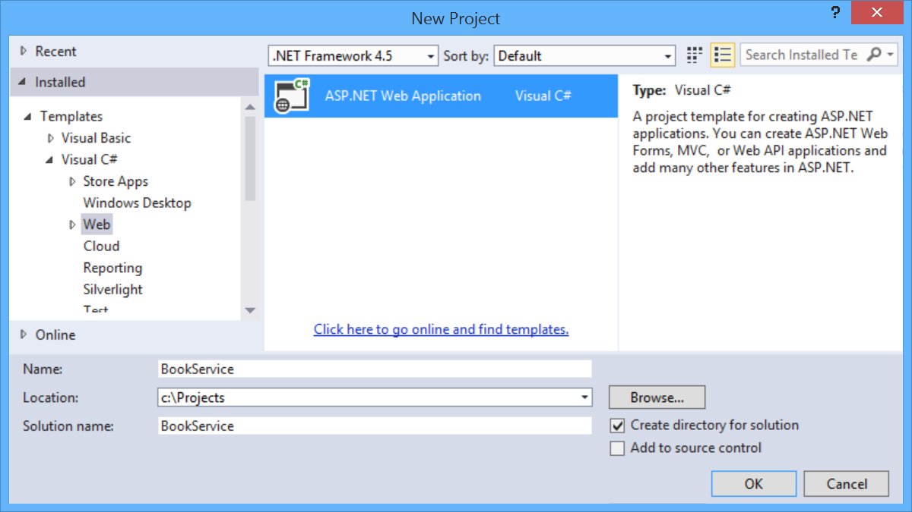
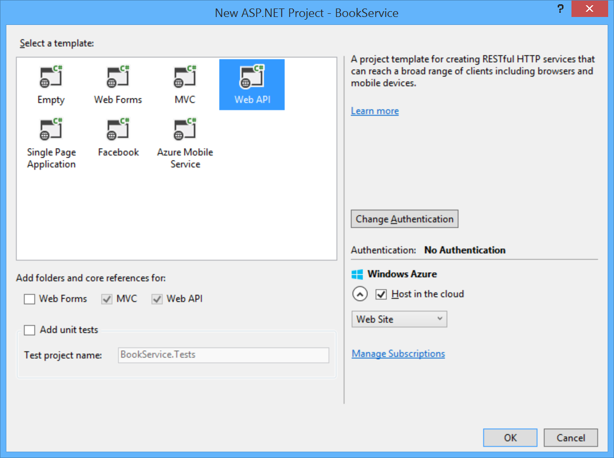
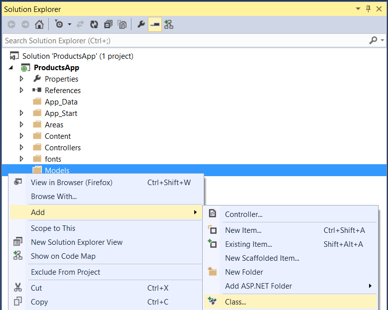

# pcf-book-service
A simple web application with an ASP.NET Web API back end. Uses Entity Framework 6 for the data layer.

References:

1) [ASP.Net Web-API Example] (http://www.asp.net/web-api/overview/data/using-web-api-with-entity-framework/part-1) (steps 1-4)

2) [ASP.Net API Help Pages Example] (http://www.asp.net/web-api/overview/getting-started-with-aspnet-web-api/creating-api-help-pages)

3) [cURL] (http://curl.haxx.se/download.html)

```
Note:
When creating the API Help pages in this project, file ~/App_Data/XmlDocument.xml 
must be included in the project or it will not be published for deployment.
```
```
Examples:
1) Create a new book with an existing author:
curl -i -X POST -H "Content-Type: application/json" http://pcf-book-service.west-1.fe.gopivotal.com/api/books -d '{"Title":"Book Title","Year":2105,"Price":19.95,"Genre":"Fantasy","AuthorId":1}'
2) Create a new book and a new author:
curl -i -X POST -H "Content-Type: application/json" http://pcf-book-service.west-1.fe.gopivotal.com/api/books -d '{"Title":"Book Title","Year":2105,"Price":19.95,"Genre":"Fantasy","Author": {"Name":"Public, John Q."}}'
```

# Build The Sample Project
#### 1) Create the Project
Open Visual Studio. From the File menu, select New, then select Project. (Or click New Project on the Start page.)

In the New Project dialog, click Web in the left pane and ASP.NET Web Application in the middle pane. Name the project BookService and click OK.



In the New ASP.NET Project dialog, select the Web API template.



#### 2) Add Models and Controllers

##### Add Model Classes

In this tutorial, we'll create the database by using the "Code First" approach to Entity Framework (EF). With Code First, you write C# classes that correspond to datbase tables, and EF creates the database. (For more information, see Entity Framework Development Approaches.)

We start by defining our domain objects as POCOs (plain-old CLR objects). We will create the following POCOs:

Author
Book
In Solution Explorer, right click the Models folder. Select Add, then select Class. Name the class Author.



Replace all of the boilerplate code in Author.cs with the following code.

```
using System.Collections.Generic;
using System.ComponentModel.DataAnnotations;

namespace BookService.Models
{
    public class Author
    {
        public int Id { get; set; }
        [Required]
        public string Name { get; set; }
    }
}
```

Add another class named Book, with the following code.

```
using System.ComponentModel.DataAnnotations;

namespace BookService.Models
{
    public class Book
    {
        public int Id { get; set; }
        [Required]
        public string Title { get; set; }
        public int Year { get; set; }
        public decimal Price { get; set; }
        public string Genre { get; set; }

        // Foreign Key
        public int AuthorId { get; set; }
        // Navigation property
        public Author Author { get; set; }
    }
}
```

Entity Framework will use these models to create database tables. For each model, the Id property will become the primary key column of the database table.

In the Book class, the AuthorId defines a foreign key into the Author table. (For simplicity, I’m assuming that each book has a single author.) The book class also contains a navigation property to the related Author. You can use the navigation property to access the related Author in code. I say more about navigation properties in part 4, Handling Entity Relations.

##### Add Web API Controllers

In this section, we’ll add Web API controllers that support CRUD operations (create, read, update, and delete). The controllers will use Entity Framework to communicate with the database layer.

First, you can delete the file Controllers/ValuesController.cs. This file contains an example Web API controller, but you don’t need it for this tutorial.
